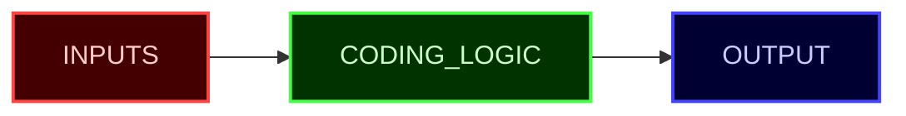

# 🧮 Functions 
Understanding functions at a fundamental level is the first building block on your path as a coder.   
Learn this deeply and you will gain 80% mastery of everything that is already out there.  
Anything you learn can be related back to functions.


How to translate the graph above to the "python" language is by abiding to the following `syntax`:

```py
def FUNCTION_NAME(INPUTS):
  # CODING LOGIC
  return OUTPUT
```

> Note: The only thing that the diagram does NOT have is the `FUNCTION_NAME`. It's simple enough, it's what you want to call your function.


# 🗡️ Practice 

## 1. Greeting 
```py
def fn1_greeting(input1):
    output = f"Hello, {input1}!" # "= is a variable assignment"
    return output

def fn1_greeting(input1):
    return f"Hello, {input1}!"

# Quiz
1. What is the function name ? 
2. What are the input parameters ? How many parameters are there ? 
3. When this function is ran  `print(fn1_greeting("Sister"))`, what will this output ? 

# Cheatsheet
def FUNCTION_NAME(FUNCTION_INPUTS):
  # CODING LOGIC
  return FUNCTION_OUTPUT
```

### 2. Addition Calculator
```py
def fn2_addition(input1, input2):
    total = input1 + input2 # this is called a variable assignment
    return total

# Quiz
1. What is the function name ? 
2. What are the input parameters ? How many parameters are there ? 
3. When this function is ran  `print(fn2_addition(5, 7))`, what will this output ? 

# Cheatsheet
def FUNCTION_NAME(FUNCTION_INPUTS):
  # CODING LOGIC
  return FUNCTION_OUTPUT
```

### 3. Convert Celsius Degrees to Fahrenheit
```py
def fn3_celsius_to_fahrenheit(celsius):
    fahrenheit = (celsius * 9/5) + 32
    return fahrenheit

# Quiz
1. What is the function name ? 
2. What are the input parameters ? How many parameters are there ? 
3. When this function is ran  `print(fn3_celsius_to_fahrenheit(5, 7))`, what will this output ? 

# Cheatsheet
def FUNCTION_NAME(FUNCTION_INPUTS):
  # CODING LOGIC
  return FUNCTION_OUTPUT
```

# Extra Credit
If this is simple enough for you, I encourage you to challenge yourself by asking deeper questions about a function. Here are a few questions to think about, feel free to do your own research using your favorite LLM tool to get a deeper understanding.

1. In the Greeting function, I see that "input1" is a string such as a name like "Sister", "Brother", "Joe", etc etc, however in function 2 and 3, they are using numbers (integers), does functions have a limit of what "data type" they can recieve? If so, how can I tell the difference? 
2. How will the fundamentals of functions help me understand deeper concepts in computer science ? Can you give me a list of things to learn? 
3. How does functions relate to APIs ? 

An understanding of a function is the key to unlock so many more doors in programming.    
With this knowledge you are able to understand bigger concepts like APIs and more complex programming literature as long as you master this deeply. 

# Conclusion
A function **takes in input parameters** and **returns an output**.    
An API **takes in a request from the user (parameters)** and **returns an output** based on the API guidelines

They are both the same thing, just different target markets. In computer science, if you have a solid understanding of the fundamentals, you will be able to see the world of programming in a much deeper way. The beauty is that as you continue programming, you will see that really complicated pieces of information out in the universe can be created by a deep understanding of simple and fundamental building blocks.
