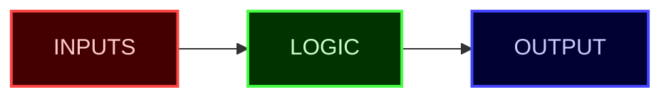
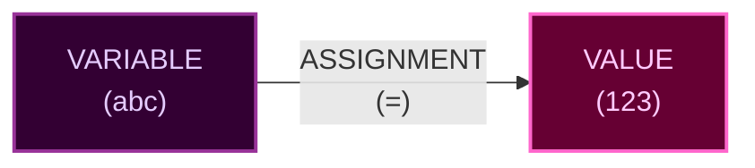

## 🧮 Functions Recap

After you have understood [functions](https://github.com/sun2ii/coding-101/blob/main/1-functions.md), (input, logic, output) you have 1 gem 💎 that you can take with you to dive deeper into the coding world.



## 🛸 Variable Assignments

A **variable** can be thought of as a **container or label that holds a value**.  
The **left side** of the assignment (`=`) is the **variable**, and the **right side** is the **value** being assigned.



Example:

```python
# VARIABLE, ASSIGNMENT, VALUE
abc = 123
xyz = "Bella"

print(abc) # Output: 123
print(xyz) # Output: "Bella"
```

This is the 2nd gem 💎 that will give you the basics of understanding the "logic" part of a function.

Most of the complexity in a function lies not in `inputs`, `outputs`, but in `logic` by **manipulating data**.  
Variables are like containers that hold data. When we work with functions, we use variables to:

- Store temporary results
- Keep track of changes
- Remember important values

# 🗡️ Practice

```python
def add3Numbers(num1, num2, num3):
    total = num1 + num2 + num3
    return total
```

## Function Quiz

1. What is the function name?
2. What are the input parameters? How many parameters are there?
3. When this function is ran `print(add3Numbers(1, 1, 1))`, what will this output?

## Variable Quiz

1. `add3Numbers(1, 2, 3)` == what would the value be for `total` be in this function?
2. `add3Numbers(2, 2, 2)` == what would the value be for `total` be in this function?
3. `add3Numbers(3, 3, 3)` == what would the value be for `total` be in this function?

## 🎯 Additional Practice Examples

Here are more ways to work with variables in functions:

```python
def multiplyNumbers(num1, num2):
    result = num1 * num2
    return result

def greetPerson(name):
    message = "Hello, " + name + "!"
    return message

def calculateAverage(num1, num2, num3):
    sum = num1 + num2 + num3
    average = sum / 3
    return average
```

## 💡 Key Concepts

### Variable Assignment

When we write `total = num1 + num2 + num3`, we are:

1. Taking the values from `num1`, `num2`, and `num3`
2. Adding them together
3. Storing the result in a new variable called `total`

## 🙅🏻‍♂️ Conclusion

In conclusion, variable assignments are used 99% of the time in all coding logic. Having a solid understanding of this fundamental allow you to **READ** code better, it improves your literacy.

With the functions framework, you can understand at a practical level what a function does.  
With the variable framework, you can take a look at the `logic` portion of a function and read deeper into what is actually happening.

By investing time into understanding deeply these 2 frameworks, variables and functions: you will be able to read any code out there and start to question other fun stuff like classes, typing, for loops, while loops, if statements, etc. These are upcoming next, but for now these 2 frameworks will give you the confidence and building blocks to be able the majority of code that's out there!
